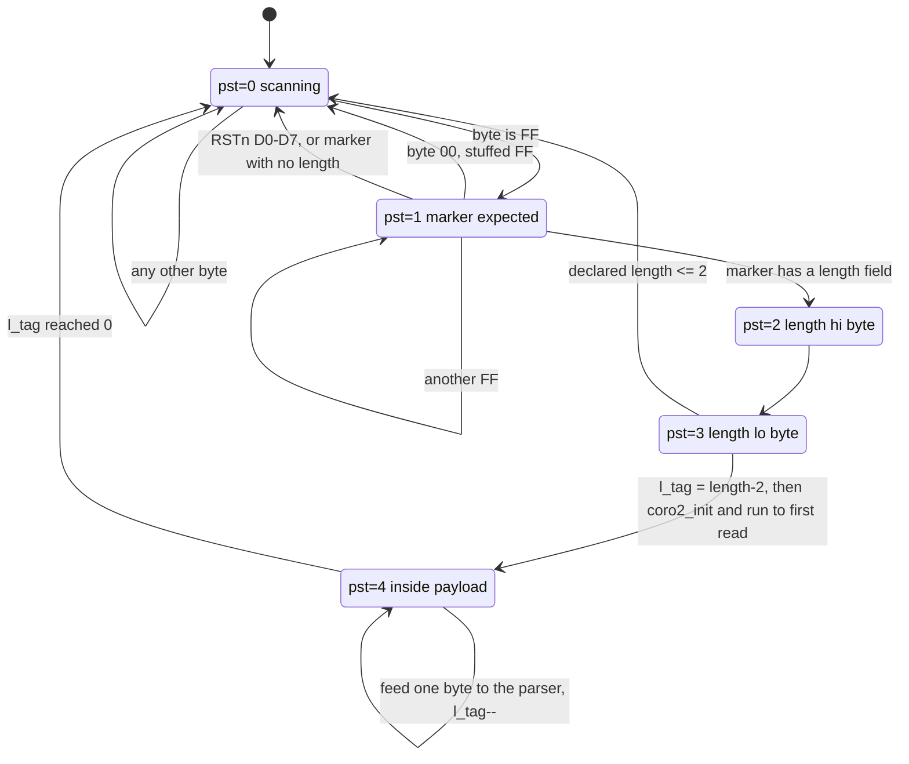

# The pjpg JPEG parsing algorithm

`pjpg` walks a JPEG file byte by byte and prints its marker structure. It is a
*structure* parser, not a decoder: it reports what segments exist and what is in
their headers, and never produces an image.

This document describes how it works, then catalogues the bugs found in it. Every
bug below has a crafted reproducer that was actually run against a plain
`g++ -O2` build; where a claim could not be reproduced it says so.

The stackful-coroutine transport in `Lib3/coro3b.inc` is deliberately out of
scope. For our purposes `get()` returns the next input byte or `uint(-1)` at
end of file, and `yield()` suspends.

---

## 1. Three layers

The program is unusual in that the parsing is spread across three cooperating
layers, two of which are coroutines at different granularities.

```
  main()  pjpg.cpp
    |
    +-- CoroFileProc<pjpg>::processfile()          coro_fp2.inc
    |     reads the file in 64 KB chunks; whenever the parser runs dry,
    |     refills the buffer and resumes it
    |
    +-- pjpg::do_process()                          pjpg1.inc      <- OUTER coroutine
    |     one iteration per input byte; a 5-state machine that finds
    |     markers and tracks how much of a segment payload is left
    |
    +-- pjpg0::do_process() -> pa_XXX()             pjpg0.inc + tag_*.inc
          the per-marker parsers, fed ONE BYTE AT A TIME by the layer
          above; each is a resumable state machine generated by
          coro_fsm.pl                                              <- INNER "coro2"
```

The two coroutine layers exist for different reasons. The outer one lets the
byte loop be written as a straight `while(1)` over the whole file even though
input arrives in fixed-size chunks. The inner one lets each marker parser be
written as ordinary straight-line code (`d[0] = coro2_get(); d[1] = coro2_get();
...`) even though it is really being driven one byte at a time by a state
machine that can abandon it at any point.

---

## 2. Layer 1 — the frontend

`CoroFileProc::processfile` (`coro_fp2.inc`) is a small pump:

```cpp
coro_init();
addout( outbuf, outbufsize );
while(1) {
  r = coro_call(this);
  if( r==1 ) {                                  // parser wants input
    l = fread( inpbuf, 1, inpbufsize, f );
    if( l==0 ) f_quit=1;
    addinp( inpbuf, l );
  } else {                                      // r0 = quit, r2 = flush, r3 = error
    ...
    if( r!=2 ) break;
  }
}
```

`f_quit` is what turns a short read into the `uint(-1)` that `get()` returns, and
that is what breaks the outer loop. pjpg never writes output, so the flush path
is inert — `main()` passes `0` as the output `FILE*`.

---

## 3. Layer 2 — the marker scanner

`pjpg::do_process` (`pjpg1.inc:16`) is the heart of the parser. It consumes
**exactly one input byte per iteration**, which is what makes the whole program
provably terminating (see §7).

State is held in `pst`:

| `pst` | meaning |
|---|---|
| 0 | scanning — ordinary data, looking for `0xFF` |
| 1 | saw `0xFF`, expecting a marker code |
| 2 | expecting the high byte of the segment length |
| 3 | expecting the low byte of the segment length |
| 4 | inside a segment payload, `l_tag` bytes still to go |



Two tables built by `init_lentag()` drive it:

* `f_lentag[256]` — markers that carry a 2-byte length field (`len2[]` in `cinfo.inc`).
* `f_ptag[256]` — markers pjpg actually parses (`parsedtags[]`): SOF0/1/2/9/10,
  APP0, APP1, DHT, DQT, SOS, DRI.

### The feeding contract

This is the single most important thing to understand about the design:

```cpp
l_tag -= (l_tag>0);                             // pjpg1.inc:36

if( (pst==4) && f_ptag[tag_id] ) {              // pjpg1.inc:38
  coro2_c = c;
  r = coro2_process(); if( r==0 ) tag_id=0;
}
```

A marker parser never reads the file. It is *fed*, one byte per outer-loop
iteration, and only while `pst==4`. Three consequences follow, and most of the
parser's behaviour — including several of the bugs — is explained by them:

1. **A parser that finishes early stops being fed.** `coro2_process()` returns
   `state!=0`; when the parser reaches `CORO_END` (which the codegen turns into
   `state=0`), the caller sets `tag_id=0`, and `f_ptag[0]` is 0, so the rest of
   the segment is skipped.

2. **A parser that does not finish is silently abandoned.** When `l_tag` reaches
   0 the scanner drops to `pst=0` and simply stops feeding. The parser is never
   told, never resumed, and never cleaned up. This is the *only* termination
   mechanism for the unbounded `while(1)` loops in `tag_DHT.inc` and
   `tag_DQT.inc`, and the reason none of them can hang.

3. **Payload bytes are never re-examined as markers.** `case 4` does not test for
   `0xFF`, so an `0xFF` inside an APP payload cannot start a false marker. This
   is correct, and it is why the Exif thumbnail's own embedded `SOI`/`EOI` do not
   appear in the output.

The `l_tag` accounting is exact. For a segment declaring length *L*, `case 3`
sets `l_tag = L-2`, and the decrement at line 36 happens once per payload byte,
so the byte on which `l_tag` hits 0 is the *L-2*'th — precisely the last payload
byte. A declared length of 0, 1 or 2 takes the degenerate branch and no parser
runs.

---

## 4. Layer 3 — the marker parsers and the `coro_fsm.pl` transform

The per-marker parsers are written in `pjpg0.inc` and the `tag_*.inc` files as
though they could pull bytes at will:

```cpp
void pa_SOF( int is_prog, int is_arith ) { CORO_START;
  data_precision = coro2_get();
  image_height   = coro2_get2();
  image_width    = coro2_get2();
  num_components = coro2_get();
  ...
  CORO_END;
}
```

The build runs the file through the C preprocessor (`-E -P`) and then through
`coro_fsm.pl`, which rewrites it into a computed-goto state machine:

| written | generated |
|---|---|
| `CORO_START;` | `if_e1( state!=0 ) goto *state;` |
| `x = coro2_get();` | `state=&&m17; return; m17: x = coro2_c;` |
| `x = coro2_get2();` | `A=coro2_get(); B=coro2_get();` hoisted above, then `x = ((A<<8)|B)` |
| `CORO_END;` | `state=0;` |

So a call to `pa_SOF()` runs until the next byte is needed, stores a label
address in `state`, and returns. The next fed byte re-enters through
`pjpg0::do_process()`, which dispatches on `tag_id` to the same `pa_XXX`, whose
`CORO_START` jumps straight back to the stored label.

**This is why every parser variable is a struct member rather than a local.**
`goto *state` jumps into the middle of the function body; a local with an
initialiser would be skipped, and a local without one would not survive the
`return`. `uint i`, `byte d[16]`, `uint n`, `uint index`, `uint count`, `pos`,
`f_LE` and the rest are all members of `cinfo`/`pjpg0`, declared at the top of
the `tag_*.inc` files. The only true parameters are `pa_SOF`'s `is_prog` and
`is_arith`, and those are safe because the dispatch switch re-supplies the same
constants on every resume.

### Constraints the transform imposes

`coro_fsm.pl` is **line-based**. It prefixes the whole line on which
`coro2_get()` appears. That silently requires:

* the `coro2_get()` statement must be a complete statement on its own line;
* it must not sit in an unbraced `if`/`for`/`while` body — the injected
  `state=…; return;` would become the body and the rest would run unconditionally;
* it must not appear inside a `for(…)` header or a loop condition;
* at most one `coro2_get2()`/`coro2_get4()` per line, since `A`/`B`/`C`/`D` are
  single shared registers and both occurrences would be replaced with the same
  expression.

The current sources honour all of this — note how `tag_APP1.inc` carefully puts
the skip loops' `coro2_get();` on its own line inside braces:

```cpp
for(; pos<ofs1st; pos++ ) {
  coro2_get();
}
```

but nothing enforces it, and a future edit that violates it will produce code
that compiles and is wrong.

---

## 5. What each parser reads

| marker | parser | reads |
|---|---|---|
| APP0 | `tag_APP0.inc` | `JFIF\0` → version, density unit, X/Y density, thumbnail w×h; `JFXX\0` → extension type; warns if `l_tag != xs*ys*3` |
| APP1 | `tag_APP1.inc` | `Exif\0\0` → TIFF header, then walks the IFD chain, recording tags 0x0103 (compression), 0x0111/0x0201 (thumbnail offset), 0x0117/0x0202 (thumbnail length), then skips the thumbnail |
| DQT | `tag_DQT.inc` | repeatedly: precision/index nibbles, then 64 coefficients in zig-zag order |
| DHT | `tag_DHT.inc` | repeatedly: table index, `bits[1..16]`, then `count = sum(bits)` symbol values |
| SOF0/1/2/9/10 | `tag_SOF.inc` | precision, height, width, component count, then per component: id, sampling factors, quant table |
| SOS | `tag_SOS.inc` | component count, then per component: id and DC/AC table nibbles; then Ss, Se, Ah, Al |
| DRI | `tag_DRI.inc` | restart interval |

---

## 6. Bugs

Ranked by severity. Reproducers were built with
`python3` and run against `011_/pjpg` built by plain `make` (g++ 13.3, `-O2`, no
sanitizer) on x86-64 Linux.

### 6.1 SOS component loop writes past `cur_comp_info[4]` — remote SIGSEGV (critical)

`tag_SOS.inc`:

```cpp
n = coro2_get();                    // attacker-controlled, 0..255
comps_in_scan = n;
for( i=0; i<n; i++ ) {
  cc = coro2_get();
  for( ci=0; ci<num_components; ci++ ) {
    if( comp_info[ci].component_id==cc ) { cur_comp_info[i]=&comp_info[ci]; break; }
  }
  ...
}
```

`cur_comp_info` is declared `jpeg_component_info* cur_comp_info[4]` in
`cinfo.inc`. The loop writes `cur_comp_info[i]` for `i` up to `n-1`, i.e. up to
254, with no bound check. JPEG allows at most 4 components in a scan, and the
array is sized for exactly that, but nothing enforces it.

The write only happens when the component id matches, so the exploit needs a SOF
declaring at least one component and a SOS whose entries all reference that
component's id.

Measured layout (`g++ -O2`, x86-64):

```
cur_comp_info   @ 62744   (end of cinfo is 136 bytes further on)
pjpg0::state    @ 62880   =  cur_comp_info[17]
pjpg0::tag_id   @ 62912   =  cur_comp_info[21]
```

Overwriting `state` (i=17) is harmless in practice — the next `coro2_get()`
immediately reassigns it before any `goto *state`. Overwriting **`tag_id`**
(i=21) is not: `tag_id` becomes the low 32 bits of `&comp_info[ci]`, and the very
next input byte evaluates `f_ptag[tag_id]` (`pjpg1.inc:38`) and then
`c_tag[tag_id]` (`pjpg0.inc:53`) — indexes roughly 2 GB out of bounds on arrays
of 256.

```python
def seg(m,p): return bytes([0xFF,m]) + struct.pack('>H', len(p)+2) + p
sof = bytes([8]) + struct.pack('>HH',16,16) + bytes([1]) + bytes([0x00,0x11,0x00])
sos = bytes([22]) + bytes([0x00,0x00])*22 + bytes([0,63,0])
open('sos_overflow.jpg','wb').write(b'\xFF\xD8' + seg(0xC0,sof) + seg(0xDA,sos) + b'\xFF\xD9')
```

```
$ ./pjpg sos_overflow.jpg ; echo $?
...
Segmentation fault
139
```

The threshold is exactly `n >= 22`, matching `cur_comp_info[21] == tag_id`.
`n = 1..21` exit 0. Under UBSan the two out-of-bounds indexes are reported
explicitly:

```
pjpg0j.inc:253:61: runtime error: index 4 out of bounds for type 'jpeg_component_info *[4]'
pjpg0j.inc:36:17:  runtime error: index 2203222120 out of bounds for type 'unsigned int [256]'
```

**Fix**: clamp the scan component count, as libjpeg does —

```cpp
n = coro2_get();
if( n<1 || n>4 ) { printf("Bogus SOS component count %u\n", n); CORO_END; return; }
```

and bound the write with `if( i<DIM(cur_comp_info) )`. Note a second defect in
the same loop: when no component id matches, the inner loop leaves
`ci == num_components` and the code then writes `comp_info[ci]` — a slot outside
the declared frame. That one stays in bounds (`num_components` is a byte,
`comp_info` is `[256]`) but silently corrupts a component that a later scan may
reference.

### 6.2 DHT symbol loop overflows `huffval[256]` by up to 3824 bytes (high)

`tag_DHT.inc`:

```cpp
count = 0;
for( i=0; i<=16; i++ ) { if( i>0 ) { bits[i] = coro2_get(); count += bits[i]; } else bits[0]=0; }

//      if( count>256 || count>length ) printf( "Bogus Huffman table definition\n" ), exit(1);

for( i=0; i<count; i++ ) { huffval[i] = coro2_get(); }
```

`bits[1..16]` are 16 attacker-controlled bytes, so `count` reaches 16 × 255 =
4080, while `huffval` is `byte[256]` inside `JHUFF_TBL`. The commented-out line
is the check that would have prevented it — the author clearly saw it.

This does **not** crash, and UBSan does not report it, for two separate reasons
worth knowing:

* the overflow is *intra-object*: `dc_huff_tbl_ptrs[0].huffval` sits at offset
  1649 of a 62880-byte `cinfo`, so 4080 bytes of overrun stay inside the same
  global object and never touch a guard page;
* UBSan's `array-bounds` check does not fire because the `h` macro,
  `((index & 0x10) ? ac_huff_tbl_ptrs : dc_huff_tbl_ptrs)`, decays the array to a
  pointer through a ternary, erasing the static bound. **Absence of a UBSan
  report on this line is not evidence of safety.**

Demonstrated instead with a probe build that prints a field the overflow lands
on. `comp_info` starts at offset 3880, which is `huffval[2231]`:

```
$ ./pjpg_probe dht_probe.jpg
    Component 66: 1hx1v q=0                       <- SOF set component_id = 0x42
Define Huffman Table 0x00
[probe] count=4080  huffval[0..4079] into byte[256]  overrun=3824 bytes
[probe] comp_info[0].component_id BEFORE huffval writes = 66
[probe] comp_info[0].component_id AFTER  huffval writes = -286331154     <- 0xEEEEEEEE
```

0xEE is the filler byte of the crafted DHT payload. The overrun silently
rewrites the quantisation tables, the other Huffman tables, `data_precision` and
the component table.

**Fix**: restore the commented-out check, and also bound it by the bytes actually
remaining in the segment:

```cpp
if( count>256 || count>l_tag ) { printf("Bogus Huffman table definition\n"); CORO_END; return; }
```

### 6.3 Bare `return` in `pa_DQT` leaves the parser resumable (medium)

```cpp
if( n>=4 ) return;                  // "Bogus DQT index"
```

`CORO_END` is what the codegen turns into `state=0`. A bare `return` skips it, so
`state` still holds the label after the last `coro2_get()`, `coro2_process()`
reports "wants more bytes", `tag_id` is not cleared, and the scanner keeps
feeding. Every subsequent byte re-enters at that label, re-reads the
precision/index nibbles, and prints another line.

The result is linear output amplification, bounded only by the segment length:

```
2 KB DQT segment of 0x0F bytes  ->  2004 lines of output
65 KB DQT segment               -> 65004 lines of output
```

A 65 KB segment is legal, and a file may contain many of them, so a small input
can produce hundreds of megabytes of output.

`tag_SOS.inc` has the same construct (`n = coro2_get(); if( n==-1 ) return;`) but
it is unreachable — see §6.8.

**Fix**: `break` out of the `while(1)` so control reaches `CORO_END`.

### 6.4 `len2[]` omits 11 length-bearing markers, so their payloads are scanned as data (medium)

`f_lentag[]` is built from `len2[]` in `cinfo.inc`, and that list is incomplete.
These markers carry a 2-byte length field per the JPEG spec but are absent:

| missing | |
|---|---|
| `C3` SOF3 | lossless, Huffman |
| `C5 C6 C7` SOF5/6/7 | differential sequential/progressive/lossless |
| `CB` SOF11 | lossless, arithmetic |
| `CD CE CF` SOF13/14/15 | differential, arithmetic |
| `DC` DNL | define number of lines |
| `DE` DHP | define hierarchical progression |
| `DF` EXP | expand reference component |

For any of them the scanner takes the `pst = f_lentag[c] ? 2 : 0` branch to
`pst=0` and resumes scanning **inside the segment payload**, so every `FF xx`
byte pair in that payload is interpreted as a real marker:

```
$ ./pjpg sof3.jpg          # a SOF3 whose payload contains the bytes FF C4 00 05 ...
!tag=D8!
!tag=C3!
!tag=C4!                   <- fabricated: this FF C4 is SOF3 payload, not a marker
Define Huffman Table 0x00
!tag=D9!
```

Beyond the misparse this widens the attack surface for §6.1 and §6.2: a
crafted SOF3 payload can inject a DHT or SOS segment that the file never
legitimately declared.

**Fix**: add the missing codes to `len2[]`. Per the spec the markers *without* a
length field are exactly `D0`–`D7` (RSTn), `D8` (SOI), `D9` (EOI), `01` (TEM) and
the `FF` fill bytes; everything else in `C0`–`FE` has one.

### 6.5 No parser state is reset between concatenated images (medium)

Nothing resets `num_components`, `comp_info`, `quant_tbl`, `saw_SOF` or
`input_scan_number` on `SOI`. A file containing two images therefore parses the
second one against the first one's frame:

```
$ ./pjpg two_images.jpg          # image 2 has a SOS but no SOF at all
...
!tag=D8!
!tag=DA!
Start Of Scan: 1 components; l_tag=5
  Component 7: dc=00 ac=00           <- component 7 does not exist in any frame
```

`num_components` is still 3 from image 1, so the id lookup runs against image
1's components, fails to match, and falls into the `ci == num_components` write
described in §6.1. `cur_comp_info[0]` keeps a pointer from the previous image.

**Fix**: reset the frame state when `M_SOI` is seen.

### 6.6 `(word&)d[6]` type-punning swaps the Exif align field (low)

`tag_APP1.inc`:

```cpp
(word&)d[6] = coro2_get2E(0,pos);
printf( "align: %c%c\n", d[6],d[7] );
f_LE = (d[6]=='I');
```

`coro2_get2E(0,…)` assembles big-endian, `(A<<8)|B`. Storing that through a
little-endian `word` puts **B** in `d[6]` and **A** in `d[7]`, so the printed
align field is reversed and `f_LE` is decided by the *second* byte rather than
the first. TIFF says the first byte decides.

```
$ ./pjpg align_IM.jpg   ->   align: MI     f_LE = 0 (big-endian)
$ ./pjpg align_MI.jpg   ->   align: IM     f_LE = 1 (little-endian)
```

Harmless for the only two legal values (`II` and `MM` are palindromes), which is
why it has never been noticed. It is also **host-endianness dependent**: on a
big-endian machine the same expression stores A in `d[6]`, silently changing
behaviour. And writing a `byte[16]` through a `word` lvalue is a strict-aliasing
violation, which matters because `gc.bat` builds with `-Ofast -fstrict-aliasing`.

**Fix**: `d[6] = A; d[7] = B;` — or read the two bytes individually and drop the
cast.

### 6.7 Integer overflow in the Exif thumbnail bounds check (low)

```cpp
if( (thumbLen>0) && (thumbOfs>=pos) && (thumbOfs+thumbLen<=len) ) {
```

`thumbOfs` and `thumbLen` are both 32-bit values read from the file, so
`thumbOfs+thumbLen` wraps. `thumbOfs=0xFFFFFFF0, thumbLen=0x20` sums to `0x10`
and passes a check it should fail:

```
$ ./pjpg thumb_wrap.jpg
thumbOfs=FFFFFFF0 thumbLen=20 thumbTyp=10; pos=0026/0026
```

The parser then enters `for(; pos<thumbOfs; pos++) coro2_get();`, a loop that
wants ~4 billion bytes. **No harm results**, because the feeding contract (§3)
cuts it off when the segment runs out — the parser is abandoned mid-skip, which
is why the `exif_done` line never prints. The bug is real; the containment is
accidental but robust.

**Fix**: `(thumbOfs <= len) && (thumbLen <= len - thumbOfs)`.

### 6.8 Dead code and unreachable checks (info)

Several things do not do what they appear to:

* **`f_MCU` is never read.** It is assigned at `pjpg1.inc:25`, `:60` and `:83`
  (`f_MCU = f_SOS`), and its only reader is a commented-out `fprintf`. Entropy-
  coded scan data is consequently never processed — `pjpg0.inc:39` is
  `case 0: /*proc_MCU();*/ break;`. This is unfinished work rather than a defect,
  but it means the flag chain that computes it is inert.
* **`pjpg0_init()` is never called.** Nothing anywhere calls it. It only zeroes
  `c_tag`, which works out because `CoroFileProc<pjpg> C` is a global and so is
  zero-initialised.
* **`c_tag[tag_id] += (state==0)` is write-only.** No code ever reads `c_tag`. It
  is nevertheless load-bearing in the wrong direction: it is one of the two
  out-of-bounds accesses that turn §6.1 into a segfault.
* **`if( n==-1 ) return;` in `tag_SOS.inc` is unreachable.** After the transform
  the line reads `n = coro2_c; if( n==-1 ) return;`, and `coro2_c` only ever
  holds a byte (0–255), so `n` can never be `0xFFFFFFFF`. (The identical-looking
  `if( c==-1 ) break;` at `pjpg1.inc:32` *is* meaningful — there `get()` really
  does return `uint(-1)` at EOF.)
* **`n` is shared between `tag_DQT.inc` and `tag_SOS.inc`**; `tag_SOS.inc` line 3
  is a commented-out `//uint n;`. Likewise `d[16]` and `i` are declared in
  `tag_APP0.inc` and reused by `tag_APP1.inc`. This is safe only because
  `coro2_init()` guarantees one parser at a time, and it is not obvious.
* **`j` in `pjpg::do_process` is declared and never used**, and `i` is declared,
  never assigned, and shadows the `i` member used by every marker parser. Only
  the commented-out trace reads it.
* **`c = 0xFF; goto parse_code;`** at `pjpg1.inc:57` is a no-op. `parse_code:`
  sits inside `case 0` and its body is just `break`, and the shift register
  `pc` was already updated with the original `c` at line 46. Nothing downstream
  reads `c` again. The FF-unstuffing therefore reduces to `pst = 0`, which
  happens to be the correct behaviour, so the dead assignment is harmless.

---

## 7. Properties that do hold

Worth stating explicitly, because the code looks more dangerous than it is in
these respects:

* **pjpg cannot hang.** The outer loop consumes exactly one input byte per
  iteration and terminates on `get()` returning `uint(-1)`. Every unbounded
  `while(1)` in a marker parser is bounded by the feeding contract. This was
  checked against the whole 118-file corpus and against crafted self-referencing
  Exif IFD chains and 4-billion-byte skip loops — all terminate.
* **Degenerate inputs are handled.** Empty file, 1-byte file, a file that is not
  a JPEG at all, and a file truncated mid-segment all exit 0 without crashing.
* **`0xFF` inside a segment payload cannot start a false marker**, so embedded
  Exif thumbnails are correctly skipped.
* **The `l_tag` accounting is exact** — a segment of declared length *L* feeds
  exactly *L-2* bytes to its parser.
* **`num_components` cannot overflow `comp_info[256]`**: it is read as a single
  byte, so it is at most 255.
* **DHT's table index is bounded** — `if( (index&15)>=4 ) break;` keeps
  `h[index&15]` in range. It is only the *symbol count* that is unchecked.
* **DQT's `quant_tbl` index is bounded** by `if( n>=4 ) return;`, and
  `jpeg_natural_order[i]` for `i<64` yields values ≤ 63, in range for
  `quantval[64]`.
* Over the 118-file corpus, gcc and clang builds produce byte-identical output,
  and UBSan (`-fno-sanitize-recover=all`) reports nothing.

---

## 8. Not implemented

* Entropy-coded scan data is skipped, not parsed (`proc_MCU()` is commented out).
  RSTn markers are recognised and ignored; `f_MCU` would have gated the MCU
  decoder that does not exist yet.
* DAC, COM and APP2–APP15 are recognised as length-bearing markers and skipped
  correctly, but their contents are not parsed.
* SOF3/5/6/7/11/13/14/15 (lossless, differential and arithmetic variants), DNL,
  DHP and EXP are not handled at all — see §6.4, their payloads are scanned as
  raw data rather than skipped.
* No validation that SOI precedes anything, that SOF precedes SOS, or that a
  referenced quantisation or Huffman table was actually defined.
